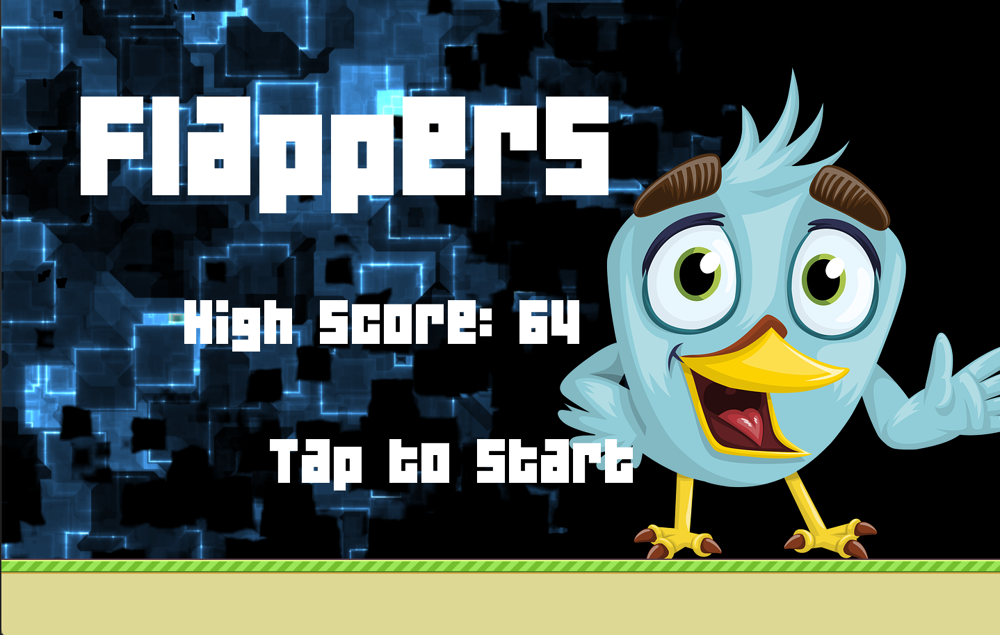
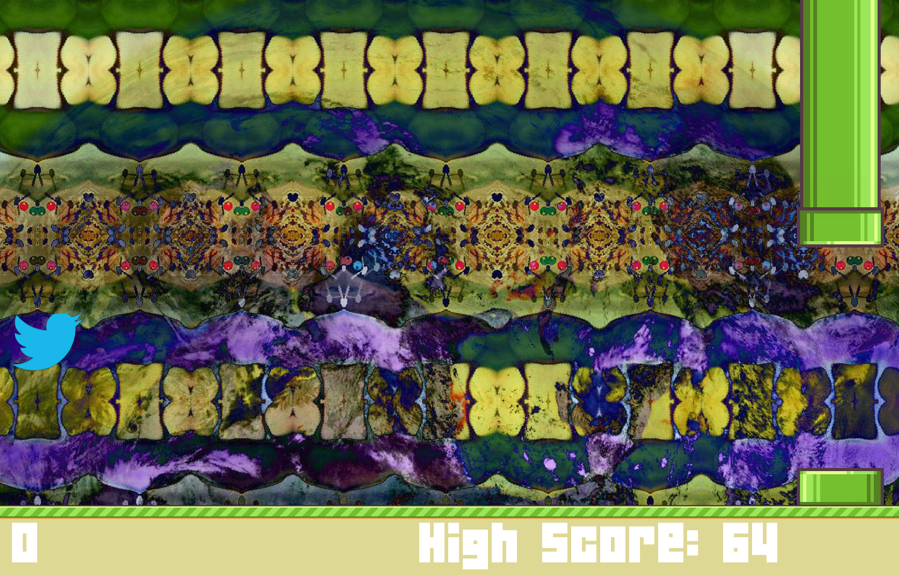
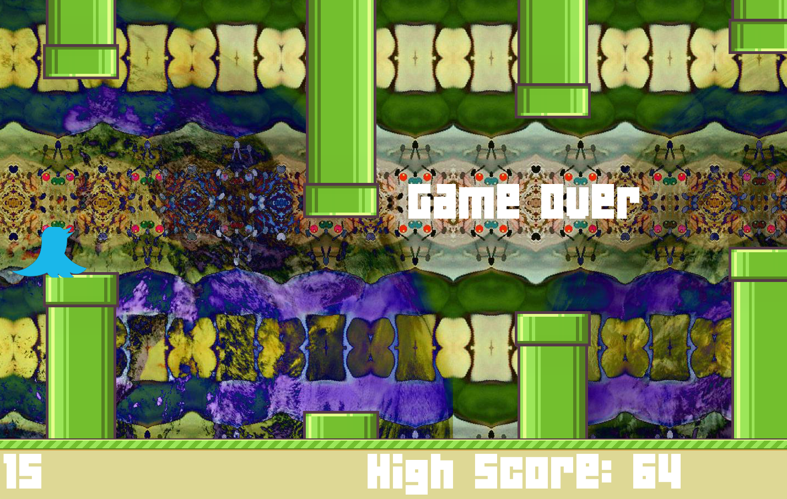

# Python-Kivy-Flappers-Game
Flappy bird game written in python using kivy gui 

Game Start

Gameplay - Press space or click the screen to "flap" up. Make it through the tubes to earn points. 

Game Over - Game ends when bird hits a pipe or the ground. Player can click to return to main screen to see high score and try again.

